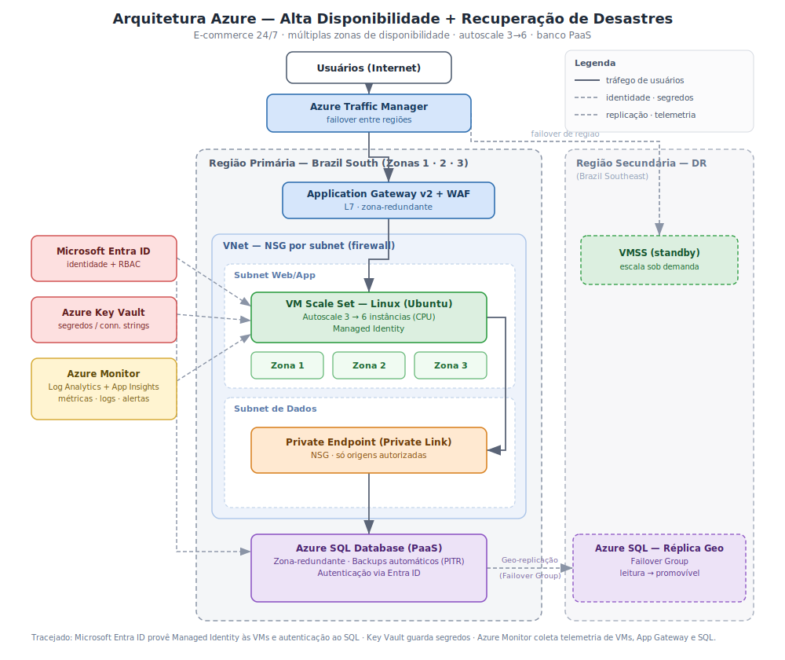

# Arquitetura de Solução em Nuvem — Alta Disponibilidade e Recuperação de Desastres

Desafio final do Bootcamp Arquiteto(a) de Soluções. O cenário é uma empresa de vendas online que precisa de um sistema disponível 24/7, resistente a falhas e capaz de absorver variações de demanda. Este repositório contém o desenho da arquitetura proposta na Azure e a documentação das decisões por trás dele.

A escolha pela Azure parte do tipo de aplicação (e-commerce sobre stack .NET com SQL Server) e do vocabulário do próprio enunciado — PaaS, IAM, zonas de disponibilidade — que mapeia de forma direta nos serviços da plataforma. A mesma topologia funcionaria em AWS ou GCP; mudam apenas os nomes dos serviços.

## Diagrama

O arquivo editável está em [`arquitetura-azure-bootcamp.drawio`](Bootcamp.drawio) e abre no [draw.io](https://app.diagrams.net).

## O que o sistema precisa resolver

Toda peça do desenho responde a uma de duas perguntas: como o sistema não cai e como ele aguenta pico de acesso. Em uma loja online as duas têm efeito direto em receita — sair do ar durante uma promoção, ou travar porque chegou muita gente de uma vez, é venda perdida na hora. As seções abaixo seguem o caminho de uma requisição, do usuário até o banco.

## Componentes da arquitetura

**Azure Traffic Manager.** É o primeiro ponto de contato, trabalhando no nível de DNS. Sua única função é decidir qual região está saudável. No funcionamento normal direciona todo o tráfego para a região primária; se a região inteira ficar indisponível, passa a apontar para a secundária. É ele que torna a recuperação de desastres entre regiões algo real, e não apenas um item no diagrama.

**Application Gateway v2 + WAF.** Dentro da região, recebe o tráfego e faz duas coisas ao mesmo tempo. Distribui as requisições entre as instâncias da aplicação — se uma instância falha, ele apenas para de encaminhar tráfego para ela, sem interrupção visível ao usuário. E aplica o Web Application Firewall, que barra ataques comuns (como injeção de SQL) antes que cheguem à aplicação. O próprio gateway é zona-redundante, para não se tornar o ponto único de falha que a arquitetura busca eliminar.

**VM Scale Set (Linux/Ubuntu).** A aplicação roda em um conjunto de escala, não em máquinas fixas. Isso atende às duas perguntas de uma vez. Distribui as instâncias entre as zonas 1, 2 e 3, de modo que a falha de um datacenter derruba apenas aquela zona e o sistema continua respondendo pelas demais. E escala sozinho conforme a CPU: parte de 3 instâncias e cresce até 6 nos momentos de maior carga, recuando depois — paga-se pelo que a demanda exigiu, não pelo pior cenário o tempo todo. Os limites de 3 e 6 são os definidos no enunciado.

**Azure SQL Database (PaaS) + Private Endpoint.** O banco é gerenciado de propósito: patch, backup, alta disponibilidade e atualização ficam a cargo da plataforma. Por padrão, porém, ele teria um endpoint público. O Private Endpoint o coloca dentro da rede virtual, de forma que o único acesso possível vem da sub-rede da aplicação e o banco deixa de ser visível pela internet. As NSGs atuam como firewall entre as sub-redes. O banco é zona-redundante (alta disponibilidade dentro da região) e mantém backups automáticos com restauração para um ponto no tempo.

**Microsoft Entra ID, Key Vault e Azure Monitor.** Sustentam a arquitetura sem aparecer no caminho principal da requisição. O Entra ID cuida de identidade e controle de acesso (detalhado abaixo). O Key Vault guarda os segredos que precisam existir. O Azure Monitor, com Log Analytics e Application Insights, coleta métricas e logs do gateway, das VMs e do banco — é o que permite localizar um gargalo quando o checkout começa a ficar lento, em vez de adivinhar.

## Alta disponibilidade x recuperação de desastres

O enunciado pede as duas coisas, e elas resolvem falhas diferentes. As múltiplas zonas de disponibilidade são alta disponibilidade: protegem contra a perda de um datacenter dentro de uma mesma região. A replicação para uma segunda região é recuperação de desastres: protege contra a perda da região inteira. A imagem que ajuda a fixar: as zonas protegem contra perder um prédio; a segunda região, contra perder uma cidade. No desenho, cada mecanismo está identificado com a falha que cobre.

## Controle de acesso (IAM)

O enunciado pede que as VMs tenham permissão de leitura e escrita no banco. Na Azure isso não se faz com usuário e senha em uma string de conexão. Cada VM recebe uma Managed Identity, o Microsoft Entra ID responde por essa identidade, e a ela são concedidas as permissões de leitura e escrita no banco (`db_datareader` e `db_datawriter`). A string de conexão não carrega segredo: a VM comprova sua identidade e o banco confia nela com base nisso. É o equivalente, na nuvem, à autenticação integrada — a credencial vem da identidade de quem solicita, não de um arquivo de configuração.

## Requisitos do desafio e como foram atendidos

| Requisito (enunciado) | Como foi atendido |
|---|---|
| Múltiplas zonas de disponibilidade | VM Scale Set distribuído nas zonas 1, 2 e 3; Application Gateway e Azure SQL zona-redundantes |
| Balanceamento de carga entre as VMs | Application Gateway v2 (camada 7) com WAF |
| Escalonamento automático — mín. 3 / máx. 6, imagens Linux | VMSS com Ubuntu e regra de autoscale por CPU (3 → 6 instâncias) |
| Banco de dados gerenciado (PaaS) com HA e segurança | Azure SQL Database zona-redundante, acessível somente via Private Endpoint |
| IAM — leitura e escrita das VMs no banco | Managed Identity das VMs autenticada pelo Entra ID (`db_datareader` / `db_datawriter`) |
| Recuperação de desastres — replicação e backups | Failover Group replicando para a região secundária; backups automáticos com PITR |
| Mecanismos de failover no diagrama | Traffic Manager (entre regiões), zonas (dentro da região) e Failover Group (banco) |

## Decisões e trade-offs

Para o failover entre regiões, optei pelo Traffic Manager (DNS) em vez do Azure Front Door. O Front Door agregaria WAF global e cache de borda, ao custo de mais complexidade e preço; para o escopo deste desafio, o Traffic Manager para o redirecionamento de região, somado ao Application Gateway com WAF na entrada da região, já cobre o requisito.

No acesso ao banco, em vez de liberar o endpoint público por regras de firewall de IP, usei Private Endpoint. A regra de IP atenderia ao pedido de "firewall para origens autorizadas", mas deixaria o banco com um endereço público exposto. O Private Endpoint retira o banco da internet por completo, uma postura de segurança mais defensável.

## Serviços Azure utilizados

Traffic Manager, Application Gateway v2 com WAF, Virtual Machine Scale Sets (Ubuntu), Azure SQL Database, Private Link / Private Endpoint, Virtual Network e NSGs, Microsoft Entra ID, Azure Key Vault, Azure Monitor (Log Analytics e Application Insights).

## Como abrir e editar o diagrama

O arquivo `.drawio` abre diretamente no [draw.io](https://app.diagrams.net) (Arquivo → Abrir). Os componentes estão como caixas estilizadas; para usar os ícones oficiais da Azure, basta habilitar a biblioteca de shapes da Azure no draw.io e substituir as formas. O `.svg` é apenas a visualização renderizada, usada na exibição acima.

## Escopo desta entrega

A Atividade 1 do desafio — o desenho da arquitetura — é o único item obrigatório, e é o que está documentado aqui. O provisionamento efetivo da infraestrutura (VMs, banco, regras de segurança) e a captura de telas são atividades opcionais do enunciado e não fazem parte desta entrega.
